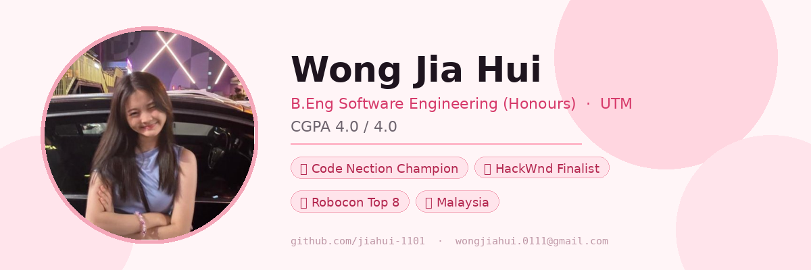

 

&nbsp;

 

---

### 👋 About Me

I'm a Software Engineering student at **Universiti Teknologi Malaysia** with a perfect CGPA of **4.0 / 4.0**. I enjoy building things that solve real problems — whether it's a hackathon sprint or a side project. I led my team to victory at **Code Nection 2025**, and I'm always looking for the next challenge.

- 📍 Malaysia
- 🎓 B.Eng Software Engineering (Honours) Computing, UTM
- 🏆 Code Nection 2025 Champion · Delulu HackWnd 2025 Finalist · UTM Robocon AutoCar Top 8
- 🎵 Flute · Guitar · Ukulele &emsp; 📷 Photography
- 🌏 English · Malay · Chinese · Cantonese

---

### 🏅 Achievements

| Award | Event | Year |
|---|---|---|
| 🥇 **Champion** *(Team Leader)* | Code Nection | 2025 |
| 🎯 **Finalist** | Delulu HackWnd | 2025 |
| 🤖 **Top 8** | UTM Robocon AutoCar Challenge | 2025 |

---

### 🎓 Education

**Universiti Teknologi Malaysia** &nbsp;·&nbsp; Bachelor of Software Engineering (Honours) Computing  
&nbsp;&nbsp;&nbsp;&nbsp;📌 CGPA **4.0 / 4.0**  
&nbsp;&nbsp;&nbsp;&nbsp;Coursework: C++, Java, Digital Logic Design, Computer Architecture, Network Comms, MySQL, R, Software Engineering Principles

**SMJK Ave Maria Convent** &nbsp;·&nbsp; SPM  
&nbsp;&nbsp;&nbsp;&nbsp;📌 **10As** ⭐

---

### 🛠️ Tech Stack

**Languages**  

**Tools & Platforms**  

**Embedded & Networking**  

---

### 📌 Featured Projects

| Project | Description | Event |
|---|---|---|
| [**CodeNection**](https://github.com/jiahui-1101/CodeNection) | 🏆 Championship-winning project | Code Nection 2025 |
| [**Unclogged**](https://github.com/jiahui-1101/unclogged) | Smart infrastructure solution | Delulu HackWnd 2025 |
| [**GodamLah 2.0**](https://github.com/jiahui-1101/GodamLah2.0) | Warehouse management system | — |
| [**SurpRice**](https://github.com/WONGZIQI0212/vhack2026-surpRice) | Food waste reduction platform | vHack 2026 |
| [**NextLevel UTM**](https://github.com/Sheng554/C2G10_nextlevelutm_SourceCode) | Campus experience app | — |
| [**Borneo HackWknd**](https://github.com/jiahui-1101/borneo_hackwknd) | Hackathon project | Borneo HackWknd |
| [**SDG XI Hackathon**](https://github.com/jiahui-1101/SDG-XI-Hackathon) | Sustainable cities challenge | SDG XI Hackathon |

---

### 📊 GitHub Stats

&nbsp;

---

*"Build, break, iterate — and sometimes win a hackathon along the way."*

 

